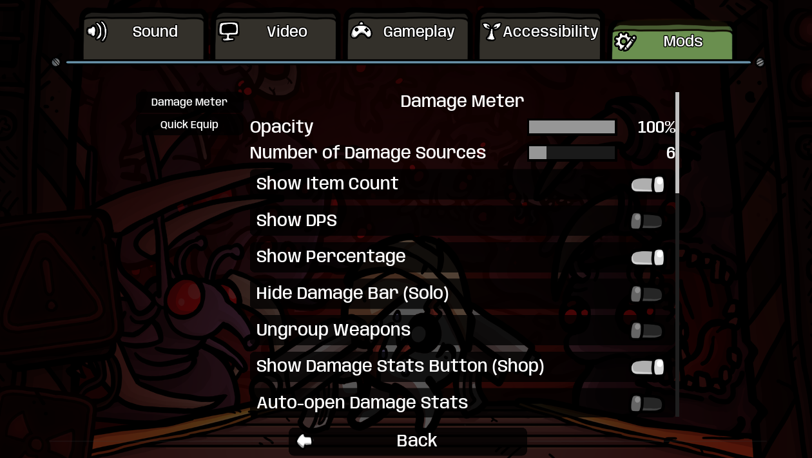
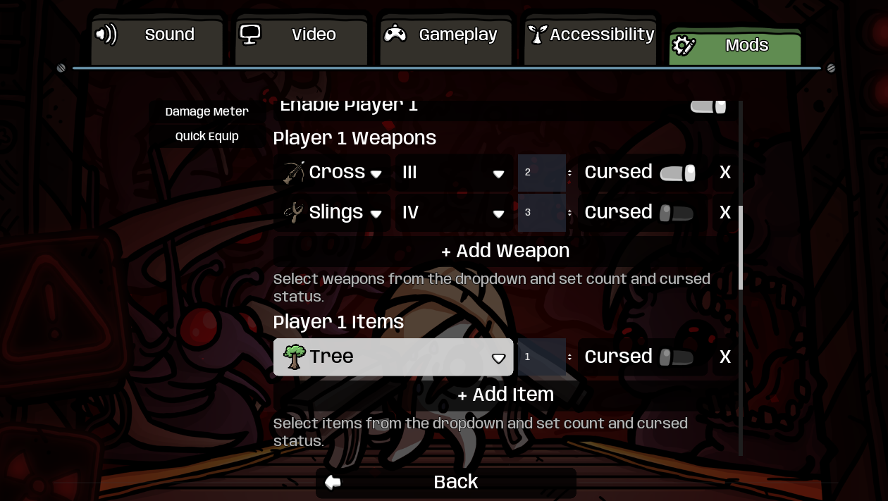
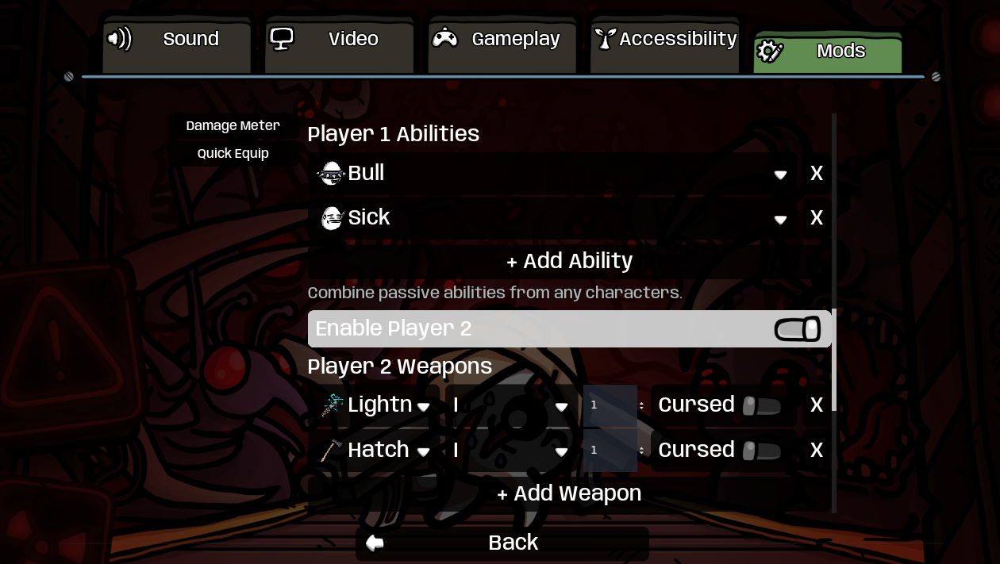
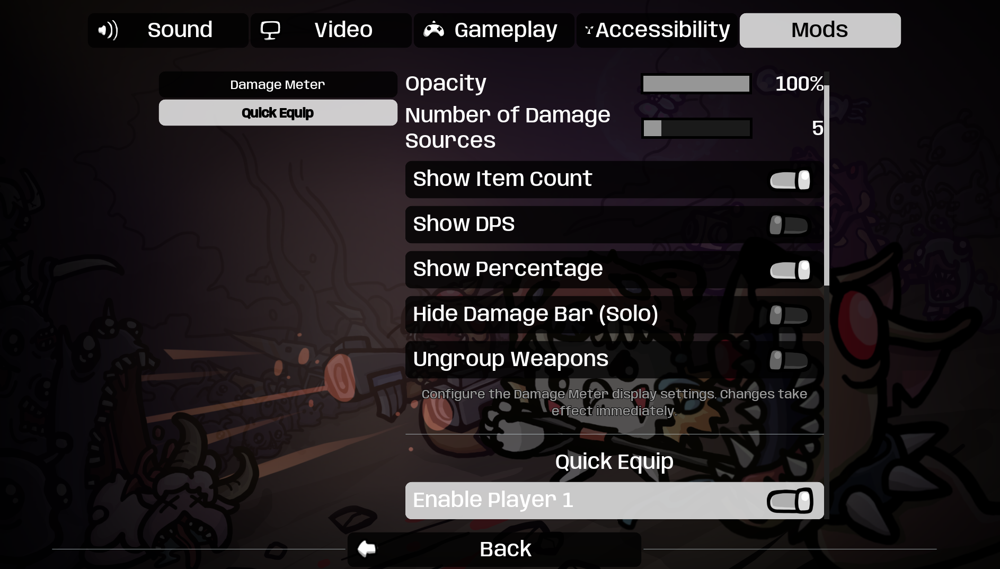

# ModOptions for Brotato

A powerful and flexible configuration framework for Brotato mods. ModOptions provides an easy-to-use API for mod developers to add in-game configuration interfaces, and a unified "Mods" tab in the Options menu where players can configure all their mods in one place.

## Features

### For Players

- **Unified Interface**: All mod configurations in one convenient "Mods" tab in Options
- **Live Updates**: Most configuration changes apply immediately without restarting
- **Persistent Settings**: All settings are automatically saved and restored
- **User-Friendly**: Clean, consistent interface for all mod settings

### For Mod Developers

- **Simple API**: Register your mod's options with just a few lines of code
- **Rich Option Types**: Sliders, toggles, dropdowns, text inputs, and custom item selectors
- **Zero Boilerplate**: No UI code needed - just define your options
- **Automatic Persistence**: Settings are saved and loaded automatically
- **Change Notifications**: Get callbacks when settings change
- **Translation Support**: Full internationalization support

## Installation

Install via [Steam Workshop](https://steamcommunity.com/sharedfiles/filedetails/?id=3598984651) or download from the repository.

## Screenshots


_Unified "Mods" tab showing configuration options for Damage Meter mod_


_Unified "Mods" tab showing configuration options for Quick Equip mod_


_Unified "Mods" tab showing configuration options for Quick Equip mod_


_Sidebar navigation for multiple mods_

## For Mod Developers

### Quick Start

1. Add `Oudstand-ModOptions` to the `dependencies` array in your existing `manifest.json`. For example (excerpt):

```json
{
    "name": "YourMod",
    "namespace": "YourName",
    "version_number": "1.0.0",
    "dependencies": ["Oudstand-ModOptions"]
}
```

2. Use the following Godot 3 example in your `mod_main.gd`. It registers options after `_ready()`, reads saved values at startup, and keeps the mod's variables updated when settings change:

```gdscript
extends Node

const MOD_ID = "YourName-YourMod"

var mod_options = null
var damage_multiplier = 1.0
var enable_feature = true

func _ready() -> void:
    call_deferred("_register_mod_options")

func _register_mod_options() -> void:
    mod_options = get_node_or_null("/root/ModLoader/Oudstand-ModOptions/ModOptions")
    if mod_options == null:
        ModLoaderLog.error("ModOptions manager not found", MOD_ID)
        return

    mod_options.register_mod_options(MOD_ID, {
        "tab_title": "Your Mod Name",
        "options": [
            {
                "type": "slider",
                "id": "damage_multiplier",
                "label": "Damage Multiplier",
                "min": 0.5,
                "max": 2.0,
                "step": 0.1,
                "default": 1.0
            },
            {
                "type": "toggle",
                "id": "enable_feature",
                "label": "Enable Special Feature",
                "default": true
            }
        ],
        "info_text": "Configure your mod settings here."
    })

    # Registration loads saved values, but does not emit config_changed.
    damage_multiplier = float(mod_options.get_value(MOD_ID, "damage_multiplier"))
    enable_feature = bool(mod_options.get_value(MOD_ID, "enable_feature"))
    mod_options.connect("config_changed", self, "_on_config_changed")

func _on_config_changed(mod_id: String, option_id: String, new_value) -> void:
    if mod_id != MOD_ID:
        return
    match option_id:
        "damage_multiplier":
            damage_multiplier = float(new_value)
        "enable_feature":
            enable_feature = bool(new_value)
```

The manager is a child of the `Oudstand-ModOptions` mod node, not a root autoload. Connect signals directly to `mod_options`; there is no `ModOptionsAPI` child, `config_manager` property, `add_option()` method, or `option_changed` signal in this API. In Godot 3, leave parameters accepting arbitrary values untyped, as with `new_value` above; do not write `new_value: Variant`.

### Persistence and ModLoader Configuration

ModOptions uses its own registration and storage system:

- `register_mod_options()` initializes defaults and loads existing values from `user://mod_options_<mod_id>.json`.
- The file is written when an option is changed through the UI or `set_value()`. Registration alone does not create it; a missing file on first launch is normal.
- Keep your mod ID and option IDs stable so saved settings can be restored.
- The registration ID is your key within ModOptions, not necessarily the manifest ID. The bundled mods use `DamageMeter` and `QuickEquip`, while their manifest IDs are `Oudstand-DamageMeter` and `Oudstand-QuickEquip`. Use the same registration ID in `get_value()`, `set_value()`, and signal filters. For a new mod, using the full manifest ID as in Quick Start helps avoid collisions; do not rename an existing registration ID without migrating its saved settings.
- Register each mod ID once. Every option requires `type`, `id`, `label`, and `default`, plus any fields required by its type below.

The ModLoader `extra.godot.config_schema` field and its `configs/<mod_id>/` files belong to a separate configuration system. A schema does not register options in the ModOptions UI, and the two systems do not synchronize automatically. You do not need a `config_schema` if your mod uses only ModOptions. If your mod also uses ModLoader's configuration API, configure that separately.

### Troubleshooting Registration

If your settings do not appear, check that the dependency is installed, the manager lookup succeeds, and `register_mod_options()` runs without validation errors. Check `godot.log` for script errors and `modloader.log` for registration messages. A ModLoader message about a missing config file does not by itself identify why a script failed to load.

### Supported Option Types

#### Slider

```gdscript
{
    "type": "slider",
    "id": "opacity",
    "label": "Opacity",
    "min": 0.0,
    "max": 1.0,
    "step": 0.1,
    "default": 0.8,
    "display_as_integer": false  # Optional: show as integer instead of float
}
```

#### Toggle (Checkbox)

```gdscript
{
    "type": "toggle",
    "id": "enabled",
    "label": "Enable Mod",
    "default": true
}
```

#### Dropdown

```gdscript
{
    "type": "dropdown",
    "id": "difficulty",
    "label": "Difficulty",
    "choices": ["Easy", "Normal", "Hard"],
    "default": "Normal"
}
```

Dropdowns store and emit the selected **value from `choices`**, not its index. In the example above, the value is `"Normal"`, not `1`. Set `default` to an element of `choices`. Choices are displayed as strings; there is no separate `enumNames` mapping.

#### Text Input

```gdscript
{
    "type": "text",
    "id": "player_name",
    "label": "Player Name",
    "default": "Anonymous",
    "multiline": false,  # Optional: use TextEdit instead of LineEdit
    "min_height": 100,   # Optional: minimum height for multiline
    "help_text": "Enter your name"  # Optional: help text below input
}
```

#### Item Selector (Advanced)

```gdscript
{
    "type": "item_selector",
    "id": "weapons_list",
    "label": "Weapons",
    "default": [],
    "item_type": "weapon",  # or "item"
    "help_text": "Select weapons from the dropdown"
}
```

### API Reference

The following calls use the `mod_options` manager reference from Quick Start.

| Method | Behavior |
| --- | --- |
| `register_mod_options(mod_id, config)` | Registers a unique mod ID, validates the options, and loads defaults and saved values. `config` requires `tab_title` and `options`; `info_text` is optional. |
| `get_value(mod_id, option_id)` | Returns the saved or default value after registration. Logs an error and returns `null` for an unknown mod or option. |
| `set_value(mod_id, option_id, value)` | Updates a registered option, attempts to save the settings, and emits `config_changed`. The caller is responsible for providing a suitable value; this method does not enforce option types or ranges. |
| `get_registered_mods()` | Returns the registered mod IDs. |
| `get_mod_config(mod_id)` | Returns the registered option definition, or an empty dictionary for an unknown mod. |
| `get_mod_values(mod_id)` | Returns a shallow copy of the current values, or an empty dictionary for an unknown mod. |

For example, update an option programmatically:

```gdscript
mod_options.set_value(MOD_ID, "damage_multiplier", 1.5)
```

#### Signals

Connect directly to the manager:

```gdscript
mod_options.connect("config_changed", self, "_on_config_changed")
```

- `config_changed(mod_id, option_id, new_value)` is emitted by `set_value()`, including UI changes. It is not emitted when saved settings are initially loaded, so read those using `get_value()` after registration.
- `mod_registered(mod_id)` is emitted after successful registration and loading of saved values.

### Translation Support

ModOptions fully supports translations. Use translation keys in your labels and help text:

```gdscript
{
    "type": "toggle",
    "id": "enabled",
    "label": "YOURMOD_ENABLE_LABEL",
    "default": true
}
```

Then add your translations using `ModLoaderMod.add_translation()` in your mod's `_init()` function.

## Examples

The Quick Start follows the same API used by the bundled mods:

- [DamageMeter registration](../Oudstand-DamageMeter/mod_main.gd): defers registration from `_ready()`, finds the sibling `Oudstand-ModOptions` node and its `ModOptions` child, then registers sliders and toggles under `DamageMeter`.
- [DamageMeter HUD settings](../Oudstand-DamageMeter/ui/hud/player_damage_updater.gd): reads current settings with `get_value()` and listens directly to the manager's `config_changed` signal to refresh the HUD.
- [QuickEquip registration and live updates](../Oudstand-QuickEquip/mod_main.gd): resolves the same manager through `/root/ModLoader`, registers under `QuickEquip`, connects directly to `config_changed`, and filters events by that registration ID. It also guards against duplicate registration and retries a missing manager lookup up to five times.
- [QuickEquip run initialization](../Oudstand-QuickEquip/extensions/run_data_extension.gd): reads stored values when applying equipment at the start of a run. This complements live updates; saved values do not generate change signals at startup.

Both registration examples use `call_deferred()` from `_ready()`. The single absolute lookup in Quick Start reaches the same manager as their step-by-step lookups. QuickEquip's retries are additional startup handling, not a different API requirement.

## Compatibility

- **Mod Loader Version**: 6.2.0+
- **Game Version**: 1.1.15.0+ (All Pain No Gain)

## Credits

- **Oudstand** — Creator and maintainer
- **L10nM4st3r** — Performance improvements, native Mods tab integration, sidebar navigation, controller support

## License

This mod is provided as-is for the Brotato community. Feel free to modify and share.

## Support

For bugs or feature requests, please create an issue on the project repository.

## Changelog

### v1.1.0

- Controller support: Mods tab now fully integrated with bumper/shoulder button navigation
- Sidebar: Quick navigation between mod settings when multiple mods are installed
- Performance: Settings injection no longer affects gameplay performance
- Compatibility: Updated for All Pain No Gain
- _Contributed by L10nM4st3r_

### v1.0.0

- Initial release
- Unified "Mods" tab for all mod configurations
- Support for slider, toggle, dropdown, text, and item_selector option types
- API-based registration system
- Automatic config persistence
- Live config updates
- Translation support
- Integer display mode for sliders
