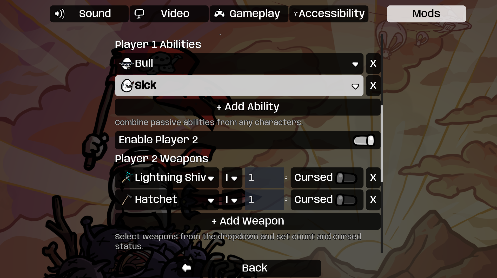
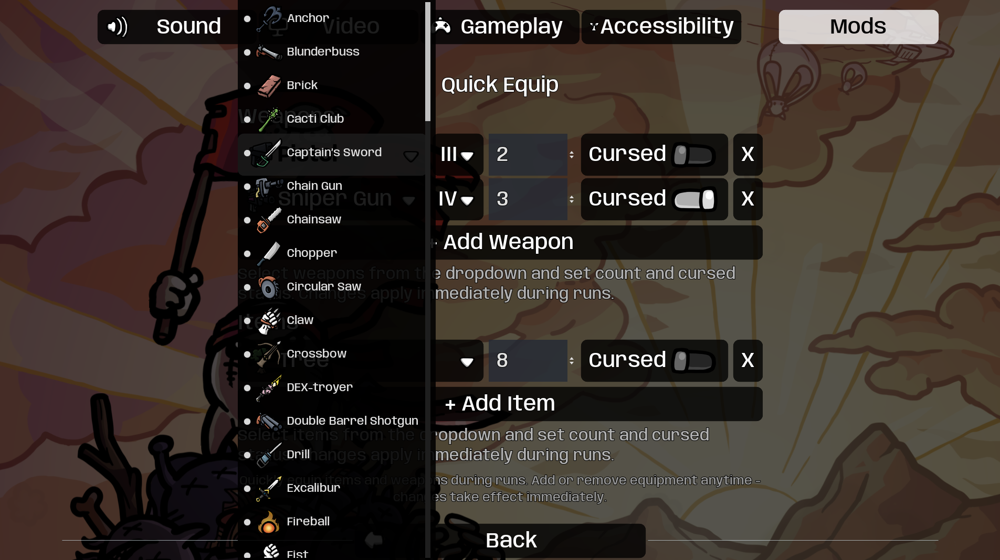
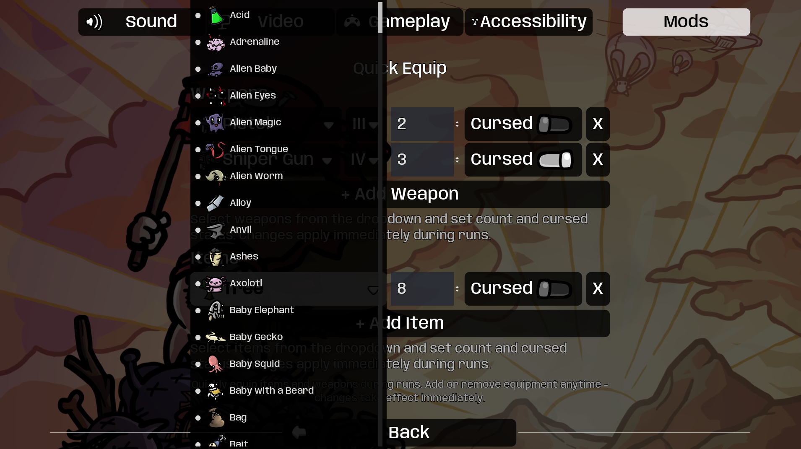
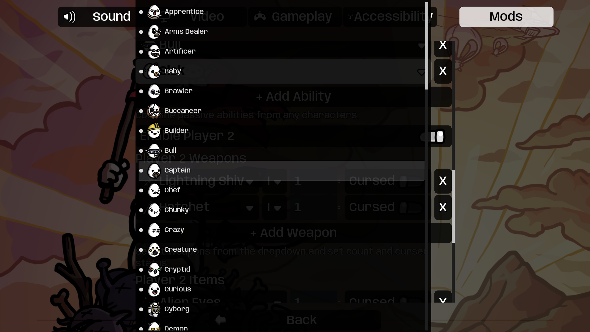

# QuickEquip for Brotato

A convenient mod for Brotato that lets you quickly equip items and weapons during runs. Configure your equipment anytime and changes apply immediately - perfect for testing builds or experimenting with different loadouts.

## Features

- **Instant Equipment**: Add or remove weapons and items during active runs
- **Live Updates**: All changes apply immediately without restarting
- **Smart Item Selection**:
  - Deduplicated dropdown lists with item icons
  - Separate tier selection (I, II, III, IV)
  - Only shows available tiers for each item
- **Full Control**:
  - Set quantity for each item/weapon
  - Mark items as cursed
  - Remove equipment anytime
- **Character Ability Mixing**: Combine passive abilities from any unlocked characters to create hybrid test builds
- **Multilingual**: Built-in English and German translations
- **Clean UI**: Integrated with ModOptions for consistent interface

## Installation

Install via Steam Workshop or download from the repository.

**Requirements:**
- **ModOptions** (Oudstand-ModOptions) - Required for the configuration interface

## Screenshots

*Item and weapon selection with icons, tier dropdowns, and quantity controls*

*Select characters and enable more players*

*Picking a weapon from the dropdown*

*Picking an item from the dropdown*

*Picking a character from the dropdown*

## Usage

1. Open the Options menu (ESC) during a run or in the main menu
2. Go to **Mods → Quick Equip**
3. Configure your equipment:

### Adding Weapons
- Click **+ Add Weapon**
- Select a weapon from the dropdown (with icon)
- Choose the tier (I, II, III, IV) - only available tiers are shown
- Set the quantity (how many copies)
- Optionally mark as cursed
- Changes apply immediately if you're in a run

### Adding Items
- Click **+ Add Item**
- Select an item from the dropdown (with icon)
- Choose the tier - only tiers that exist for that item are shown
- Set the quantity
- Optionally mark as cursed
- Changes apply immediately

### Adding Character Abilities
- Scroll down to **Character Abilities**
- Click **+ Add Ability**
- Pick any character whose passive kit you want to borrow
- Add as many different abilities as you like (duplicates are ignored)
- Passives are applied instantly, letting you create hybrid characters on the fly
- Added abilities appear in your inventory like normal items (complete with tooltips), so you can always review what is active
### Removing Equipment
- Click the **X** button next to any item/weapon
- It will be removed from your inventory instantly if you're in a run

### Smart Tier Selection
- Each item only shows its available tiers in the tier dropdown
- Items with minimum tier requirements (e.g., Anchor requires minimum Tier II, Dex Sweater requires Tier IV) automatically filter out unavailable tiers
- If an item only exists in one tier, the tier dropdown is hidden

## How It Works

### During Runs
- **Adding**: Weapons and items are added to your character immediately
- **Removing**: Equipment is removed from both your inventory and character
- **Tracking**: The mod tracks what it has given you, so removals only affect QuickEquip items

### Equipment Persistence
- Your configuration is saved automatically
- Settings persist between runs and game sessions
- Start new runs with your configured equipment
- Change configuration anytime - even mid-wave

## Use Cases

- **Build Testing**: Quickly test weapon and item combinations
- **Challenge Runs**: Start with specific equipment for custom challenges
- **Learning**: Experiment with items you haven't unlocked yet
- **Speed Testing**: Skip the shopping phase and jump straight to testing
- **Content Creation**: Set up specific builds for videos or screenshots

## Configuration

All settings are managed through the in-game UI via ModOptions. No manual file editing required.

**Available Options:**
- Weapons list with tier, quantity, and cursed status
- Items list with tier, quantity, and cursed status

## Translations

QuickEquip includes translations for:
- **English** (en)
- **German** (de)

The game will automatically use the appropriate language based on your system settings.

## Compatibility

- **Mod Loader Version**: 6.2.0+
- **Game Version**: 1.1.12.0+
- **Dependencies**: Oudstand-ModOptions (required)

## Known Limitations

- Only works with vanilla items and weapons (modded items depend on mod compatibility)
- Equipment is not added to the shop or normal loot pools - it's directly equipped
- Borrowed character abilities only include passive/stat effects. Unique hard-coded behaviors (e.g., Renegade shop logic, elite spawn tweaks from Jack/Ogre) still follow your currently selected base character.

## Credits

Created by Oudstand

## License

This mod is provided as-is for the Brotato community. Feel free to modify and share.

## Support

For bugs or feature requests, please create an issue on the project repository.

## Changelog

### v1.1.0
- Renamed from AutoGive to QuickEquip (better reflects functionality)
- Removed unnecessary "Enabled" toggle
- Added full translation support (English, German)
- Improved UI with item icons
- Implemented smart tier selection (only show available tiers)
- Deduplicated item lists (one entry per item, separate tier dropdown)
- Live equipment updates during runs
- Proper item removal from player entity

### v1.0.0
- Initial release as "AutoGive"
- Basic weapon and item addition at run start
- Count and cursed status support
