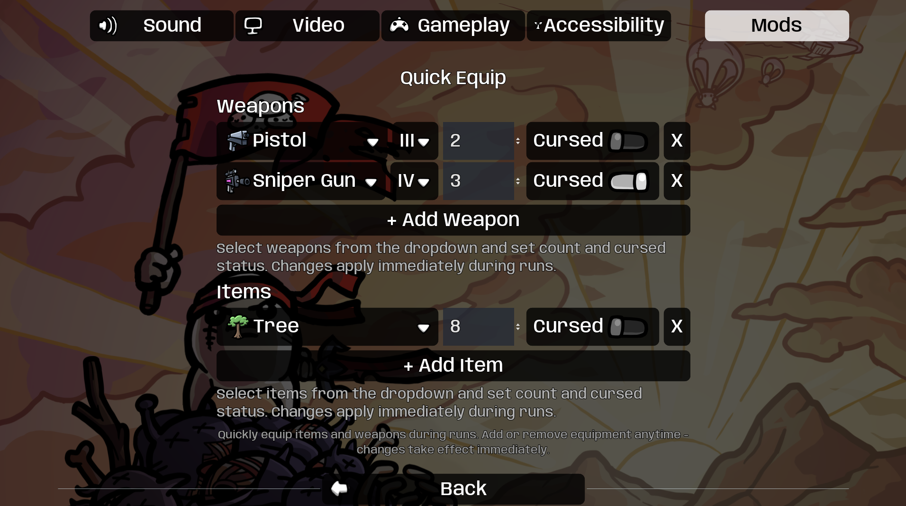

# Brotato Mods Collection by Oudstand

A collection of quality-of-life and enhancement mods for Brotato, featuring a powerful configuration framework and useful gameplay tools.

## Mods Included

### 🔧 ModOptions
**A flexible configuration framework for Brotato mods**

ModOptions provides an easy-to-use API for mod developers to add in-game configuration interfaces. All mod settings appear in a unified "Mods" tab in the Options menu, providing a consistent and user-friendly experience.

**Key Features:**
- Unified configuration interface for all mods
- Rich option types: sliders, toggles, dropdowns, text inputs, item selectors
- Live configuration updates
- Automatic setting persistence
- Simple API for mod developers
- Full translation support

[📖 Read More](Oudstand-ModOptions/README.md)

---

### 📊 DamageMeter
**Real-time damage tracking and statistics**

DamageMeter displays comprehensive damage statistics during runs, showing total damage dealt and top damage sources for each player. Perfect for analyzing builds and optimizing strategies.

**Key Features:**
- Real-time damage tracking with progress bars
- Top damage sources display (weapons, items, abilities)
- Tracks spawned entities (turrets, landmines, etc.)
- Item grouping with rarity indicators
- Configurable via ModOptions
- Performance optimized

[📖 Read More](Oudstand-DamageMeter/readme.md)

---

### ⚡ QuickEquip
**Instantly equip items and weapons during runs**

QuickEquip lets you add or remove weapons and items anytime during a run. Perfect for testing builds, experimenting with equipment, or setting up challenge runs.

**Key Features:**
- Add/remove equipment during active runs
- Smart item selection with icons and tier dropdowns
- Live updates - changes apply immediately
- Configure quantity and cursed status
- Clean UI integrated with ModOptions
- Multilingual (English, German)

[📖 Read More](Oudstand-QuickEquip/README.md)

---

## Screenshots

*Unified "Mods" tab in Options menu*

*DamageMeter showing damage statistics during gameplay*

*QuickEquip configuration with item selection*

## Configuration

All mods can be configured in-game:
1. Launch Brotato
2. Go to **Options** (ESC or main menu)
3. Select **Mods** tab
4. Configure each mod's settings

Settings are automatically saved and persist between sessions.

## Compatibility

- **Mod Loader Version**: 6.2.0+
- **Game Version**: 1.1.12.0+
- **Multiplayer**: Full support (DamageMeter supports up to 4 players)

## For Mod Developers

Want to add configuration to your own mod? See the [ModOptions README](Oudstand-ModOptions/README.md) for full API documentation and examples.

## ☕ Support this project

This project is developed and maintained in my free time.  
If you enjoy the mods or find them useful, you can support the development:

Thank you for supporting open source! 💙

## License

These mods are provided as-is for the Brotato community. Feel free to modify and share.

## Support

For bugs, feature requests, or questions:
- Create an issue on this repository
- Check individual mod READMEs for specific documentation

## Changelog

### ModOptions v1.0.0
- Initial release with unified configuration interface

### DamageMeter v1.2.0
- Full ModOptions integration
- Live configuration updates
- Improved performance

### QuickEquip v1.1.0
- Renamed from AutoGive
- Added translation support
- Smart tier selection
- Icon-based UI

---

**Enjoy the mods! Happy farming! 🥔**
